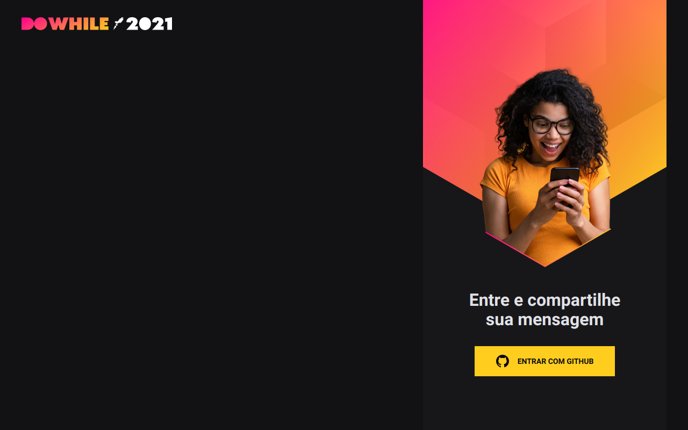

<h1 align="center">
    
</h1>

## 🧪 Tecnologias

Esse projeto foi desenvolvido com as seguintes tecnologias:

- [React](https://reactjs.org)
- [Firebase](https://firebase.google.com/)
- [TypeScript](https://www.typescriptlang.org/)

## 💻 Projeto

DOWHILE 2021 é uma aplicação de SPA, com perguntas e respostas em tempo real. 

Este é um projeto desenvolvido durante a **[Next Level Week Heat](https://nextlevelweek.com/)**.

## Como utilizar

Clone a [API](https://github.com/VictorOliveira2k/NLWTogether-NodeJS) no repositório  
Rode o npm install  
Depois, rode yarn dev para dar o start
